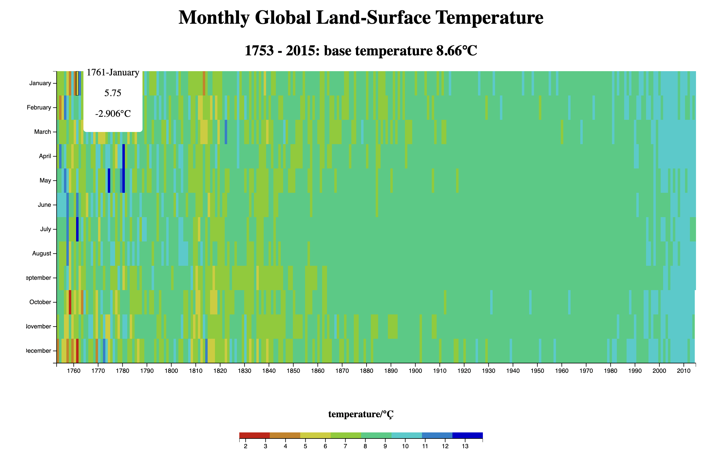

# Heat-map
- A map of data showing the earth temperature from the year of 1753 to 2015.
- This visulization is realized by using the d3 library based on the basic HTML, CSS, and Javascript languages.
- This project contribute to the completion of the data visulization certification of FreeCodeCamp.

### Live Link
https://chuanqizhu0820.github.io/Heat-map/

